Build Number: 8

Build Date and Time: 2026-07-03T14:12:43Z

Test Type: long-running (soak)

Test Duration: ~30.1 hours (30.106h, 361 samples)

Thunder Pack URL: https://github.com/thunder-id/thunderid/releases/download/v0.46.0/thunderid-0.46.0-linux-x64.zip

Deployment Pattern: single-node

Thunder Instance Type: m8i.large

Nginx Instance Type: t3a.small

Bastion Instance Type: m8i.xlarge

Database Instance Type: db.m6i.xlarge

Database Type: postgres

Concurrency: 1000

Additional Params: -d 1800 -w 10 -x false -y JWT

Use Delays: true

Thunder Instance ID: i-0dff026c1cce8b8c1

Nginx Instance ID: i-0f25dfdc78bac05a9

Bastion Instance ID: i-000d80a278f77cd28

RDS Instance ID: wso2thunderdbinstance3518

Performance Repo: https://github.com/asgardeo/thunder-performance

Pipeline Definition Branch: long-running

Checkout Ref (code under test): long-running

## Test Overview

This is a **long-running (soak) test** of the OAuth 2.0 Authorization Code grant flow,
sustained at **1000 concurrent users for ~30 hours**. Unlike the standard multi-concurrency
benchmarks, the goal here is to surface behaviour that only appears over time — memory drift,
unbounded data/log growth, and latency creep. Alongside the usual JMeter summary and CloudWatch
metrics, this run captures long-running resource-growth trends and end-to-end latency drift.

Results were collected via the `vm-perf-collect.yml` pipeline (trigger run number 8).

## Summary

| Scenario Name | Heap Size | Concurrent Users | Label | # Samples | Error % | Throughput (Requests/sec) | Average Response Time (ms) | 95th Percentile of Response Time (ms) |
| --- | --- | --- | --- | --- | --- | --- | --- | --- |
| Authorization Code Grant Type | N/A | 1000 | 1 Send request to authorize endpoint | 17897693 | 0.00 | 165.72 | 5.14 | 8.00 |
| Authorization Code Grant Type | N/A | 1000 | 2 Start Authentication Flow | 17897693 | 0.00 | 165.72 | 3.76 | 6.00 |
| Authorization Code Grant Type | N/A | 1000 | 3 Perform authentication | 17896695 | 0.00 | 165.71 | 7.31 | 11.00 |
| Authorization Code Grant Type | N/A | 1000 | 4 Obtain authorization code | 17896694 | 0.00 | 165.71 | 4.90 | 7.00 |
| Authorization Code Grant Type | N/A | 1000 | 5 Obtain access token | 17896693 | 0.00 | 165.71 | 5.16 | 8.00 |

Full per-label statistics (all percentiles, min/max, throughput in KB/sec, etc.) are in
[`summary.csv`](summary.csv). Over ~30 hours the flow served **~89.5M complete authorization-code
journeys with a 0.00% error rate** and a stable ~165 req/sec throughput per step.

## CloudWatch Metrics

Metrics are reported two ways: **min / avg / max tables** (as published in the pipeline job
summary) and the corresponding **time-series graphs**.

### Thunder (EC2)

| Metric | Unit | Min | Avg | Max |
| --- | --- | ---: | ---: | ---: |
| CPU Utilization | % | 0.692 | 45.1 | 87.597 |
| Network In | MB | 0.01 | 126.452 | 168.285 |
| Network Out | MB | 0.008 | 161.846 | 3270.0 |
| Disk Read Ops | ops/period | — | — | — |
| Disk Write Ops | ops/period | — | — | — |
| Disk Read | MB/period | — | — | — |
| Disk Write | MB/period | — | — | — |

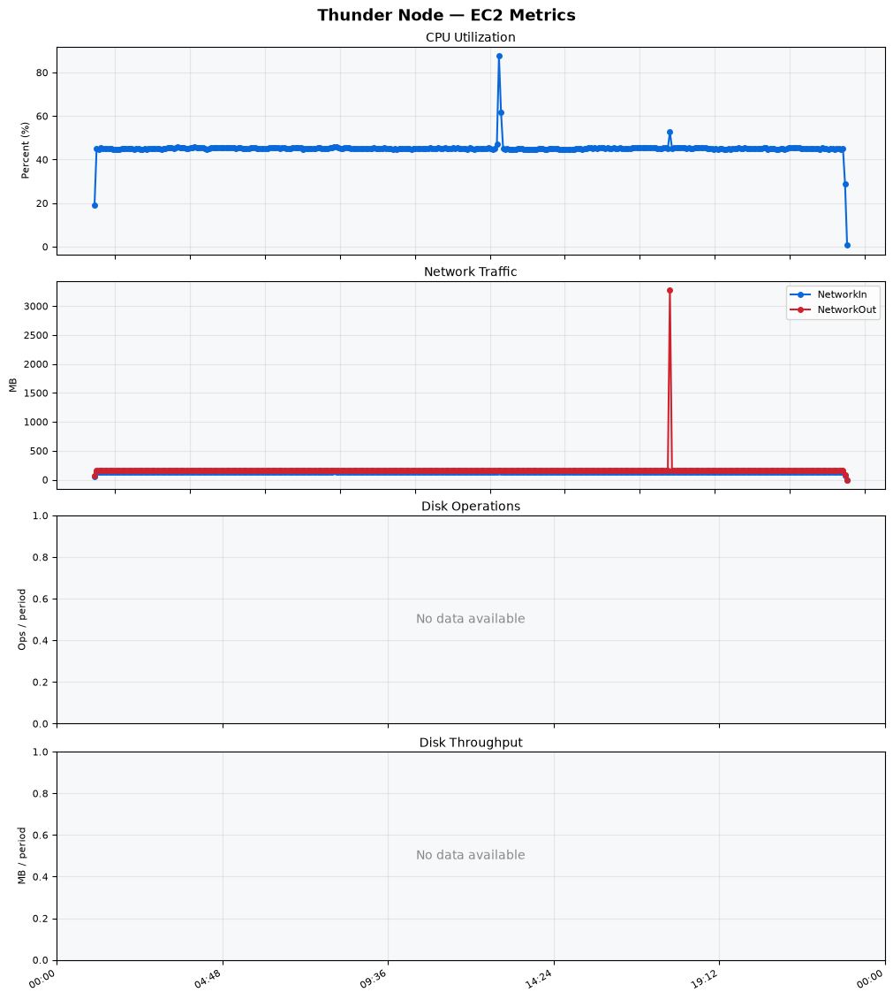

### Nginx (EC2)

| Metric | Unit | Min | Avg | Max |
| --- | --- | ---: | ---: | ---: |
| CPU Utilization | % | 0.108 | 14.23 | 39.674 |
| Network In | MB | 0.0 | 91.819 | 129.207 |
| Network Out | MB | 0.0 | 99.106 | 1187.956 |
| Disk Read Ops | ops/period | — | — | — |
| Disk Write Ops | ops/period | — | — | — |
| Disk Read | MB/period | — | — | — |
| Disk Write | MB/period | — | — | — |

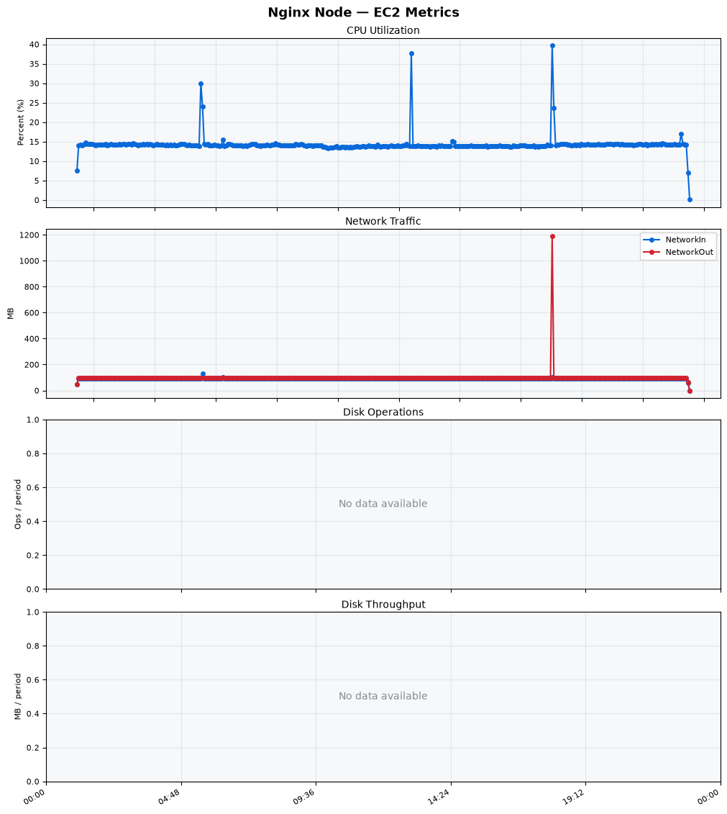

### Bastion (EC2)

| Metric | Unit | Min | Avg | Max |
| --- | --- | ---: | ---: | ---: |
| CPU Utilization | % | 9.754 | 10.122 | 16.689 |
| Network In | MB | 0.002 | 73.52 | 3177.762 |
| Network Out | MB | 0.002 | 31.632 | 36.583 |
| Disk Read Ops | ops/period | — | — | — |
| Disk Write Ops | ops/period | — | — | — |
| Disk Read | MB/period | — | — | — |
| Disk Write | MB/period | — | — | — |

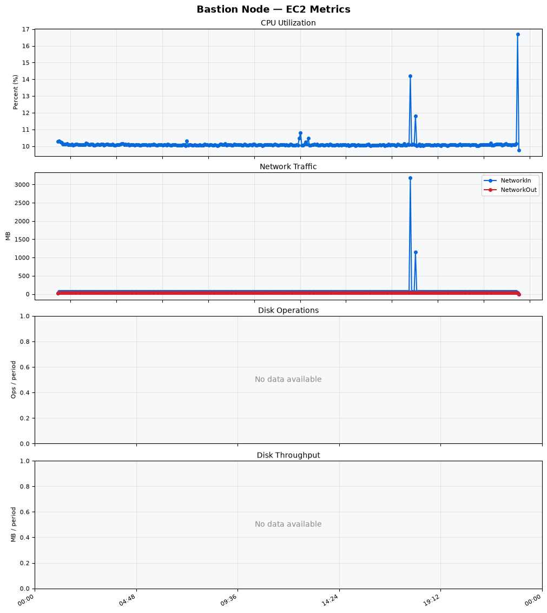

### RDS

RDS CloudWatch metrics were not captured for this run (`cloudwatch/rds.csv` contains no data
points), so no min/avg/max table or graph is available. Database growth over the run is instead
tracked below under **Long-Running Resource & Data Growth** (`runtimedb_bytes` and the row-count
series).

## Long-Running Resource & Data Growth

Sampled every ~5 minutes over the ~30.1-hour run (361 samples). `Slope / hour` is the
least-squares linear trend and `R²` its goodness-of-fit — a high R² on a positive slope indicates
sustained, near-linear growth. Source data: [`long-run-summary.json`](long-run-summary.json) and
[`long-run-metrics.csv`](long-run-metrics.csv).

| Metric | Unit | First | Last | Min | Max | Slope / hour | R² |
| --- | --- | ---: | ---: | ---: | ---: | ---: | ---: |
| `thunder_rss_kb` | MB | 44.97 | 41.59 | 41.59 | 51.30 | 0.0384 | 0.1688 |
| `thunder_vsz_kb` | MB | 1,264.47 | 1,329.04 | 1,264.47 | 1,329.04 | 2.4114 | 0.5661 |
| `thunder_disk_used_bytes` | GB | 2.72 | 7.84 | 2.72 | 18.47 | 0.1468 | 0.0778 |
| `thunder_disk_avail_bytes` | GB | 16.47 | 11.35 | 0.72 | 16.47 | -0.1468 | 0.0778 |
| `thunder_log_bytes` | MB | 1.52 | 20,154.66 | 1.52 | 20,154.66 | 671.7561 | 1.0000 |
| `runtimedb_bytes` | MB | 13.05 | 11,049.95 | 13.05 | 11,049.95 | 368.4486 | 1.0000 |
| `count_authorization_code` | rows | 543 | 17,896,694 | 543 | 17,896,694 | 596,526.8378 | 1.0000 |
| `count_authorization_request` | rows | 1,000 | 999 | 982 | 1,000 | 0.0208 | 0.0067 |
| `count_flow_context` | rows | 999 | 998 | 979 | 1,000 | 0.0205 | 0.0039 |
| `count_ciba_auth_request` | rows | 0 | 0 | 0 | 0 | 0.0000 | 0.0000 |
| `count_webauthn_session` | rows | 0 | 0 | 0 | 0 | 0.0000 | 0.0000 |
| `count_attribute_cache` | rows | 0 | 0 | 0 | 0 | 0.0000 | 0.0000 |
| `count_par_request` | rows | 0 | 0 | 0 | 0 | 0.0000 | 0.0000 |
| `count_jti_record` | rows | 0 | 0 | 0 | 0 | 0.0000 | 0.0000 |
| `count_openid4vp_request_state` | rows | 0 | 0 | 0 | 0 | 0.0000 | 0.0000 |
| `count_openid4vci_nonce` | rows | 0 | 0 | 0 | 0 | 0.0000 | 0.0000 |
| `count_openid4vci_credential_offer` | rows | 0 | 0 | 0 | 0 | 0.0000 | 0.0000 |

**Observations**

- **Process memory is stable.** Thunder RSS stays ~42–51 MB with no upward trend (slope
  +0.04 MB/h, R²=0.17); VSZ nudges up ~2.4 MB/h but plateaus — no evidence of a heap/native leak.
- **Unbounded log & DB growth.** `thunder_log_bytes` (+672 MB/h) and `runtimedb_bytes` (+368 MB/h)
  both grow perfectly linearly (R²=1.0), driven by `count_authorization_code` rows accumulating at
  ~596k/hour to ~17.9M — issued authorization codes are never purged, and available disk fell from
  16.5 GB to a low of 0.72 GB. This is the main long-run risk surfaced by the test.
- **Bounded working sets.** `count_authorization_request` and `count_flow_context` stay flat at
  ~1000 (matching concurrency); unused flows (CIBA, WebAuthn, PAR, OpenID4VP/VCI, JTI) remain at 0.

### Process & Resource Trends

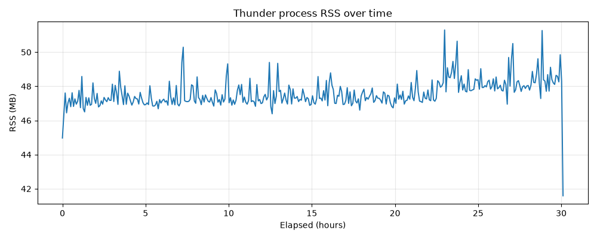
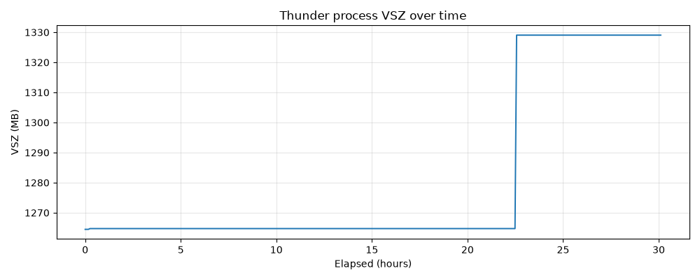
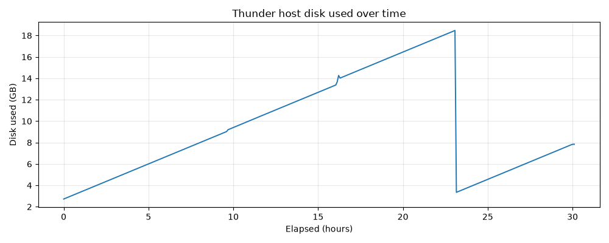
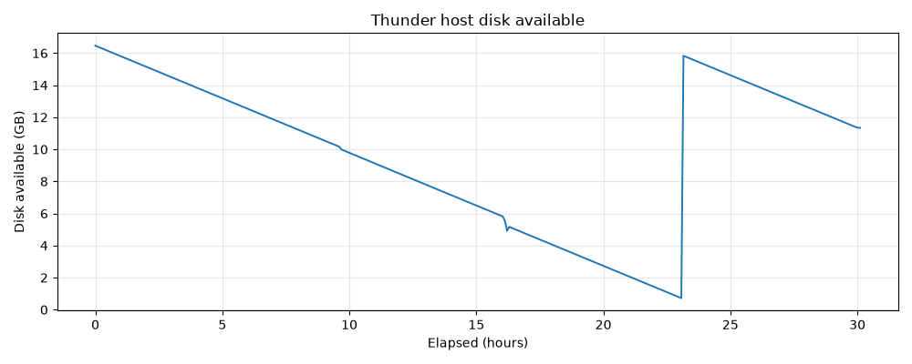
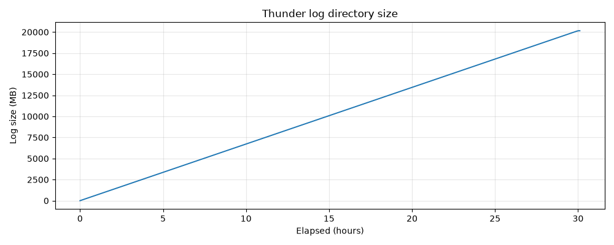
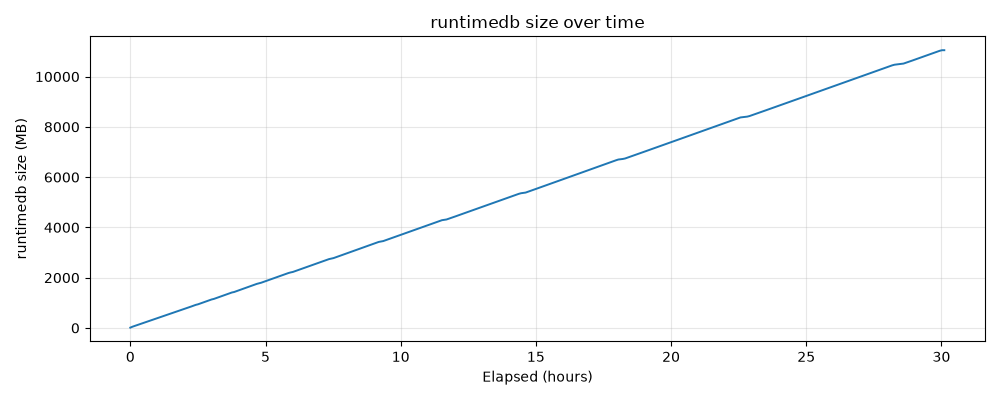

### Table Row-Count Trends

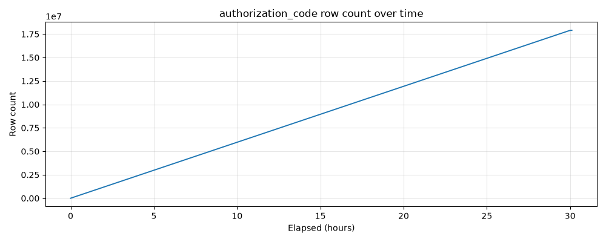
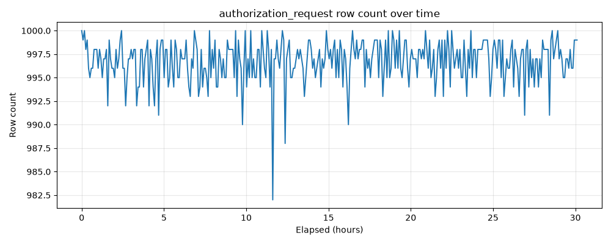
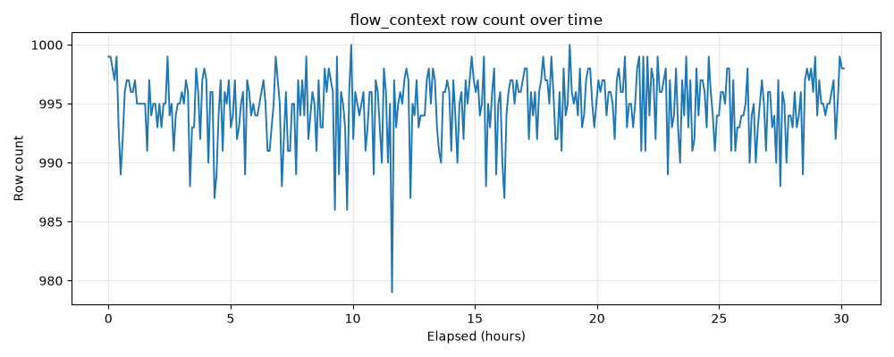

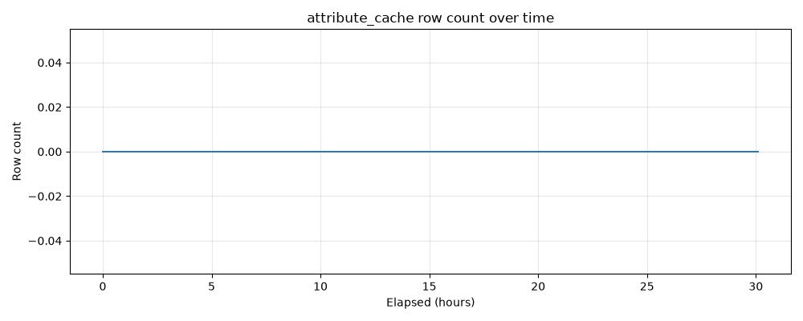
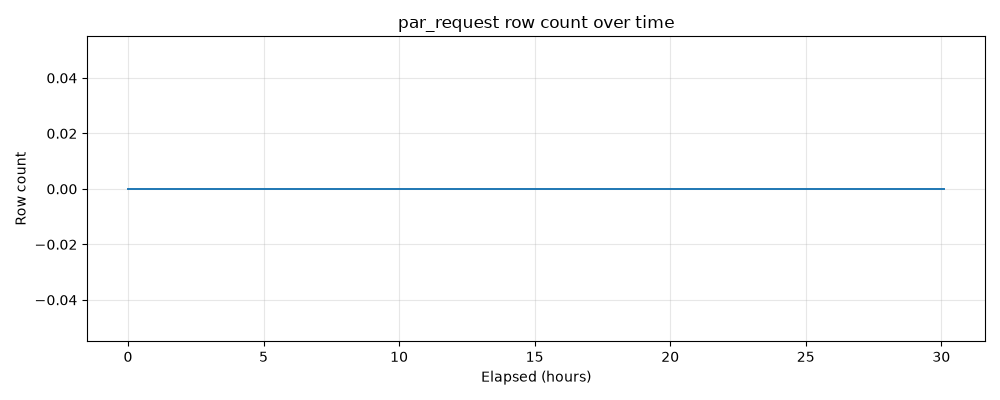
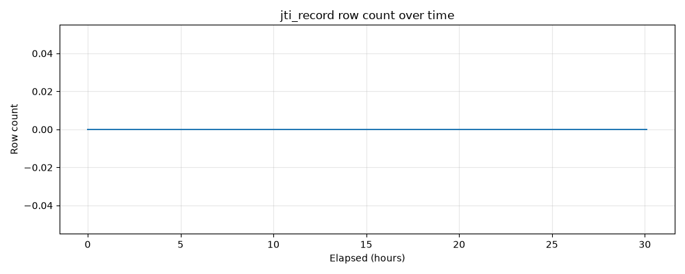
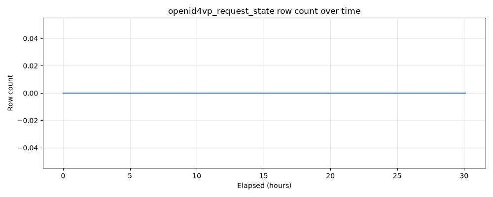
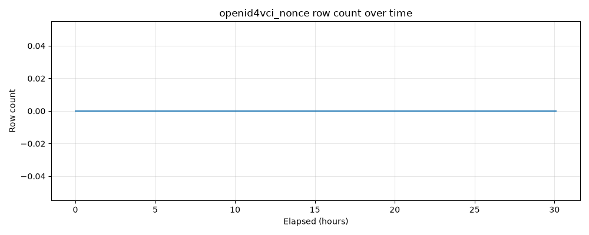
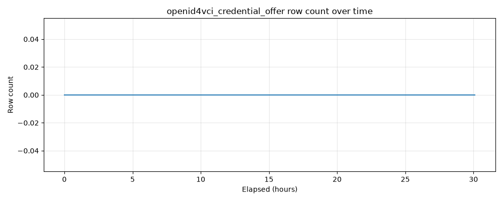

## Latency Drift

End-to-end latency of the full Authorization Code flow, bucketed into 300-second windows over the
run, to detect creep. Source data: [`latency-drift.json`](latency-drift.json) and
[`latency-drift/.../latency-drift.csv`](latency-drift/01-thunder_oauth_authorization_code_grant/default/1000_users/latency-drift.csv).

| Scenario | Buckets | Bucket Size | Total Requests | p95 First Bucket (ms) | p95 Last Bucket (ms) | p95 Slope (ms/hour) | p95 R² |
| --- | ---: | ---: | ---: | ---: | ---: | ---: | ---: |
| 01-thunder_oauth_authorization_code_grant / default / 1000_users | 361 | 300s | 89,485,468 | 8 | 10 | 0.019 | 0.0202 |

**Observation:** p95 latency is essentially flat over 30 hours (8 ms → 10 ms, slope +0.019 ms/h
with R²=0.02) — no meaningful latency degradation despite the DB and log growth noted above.

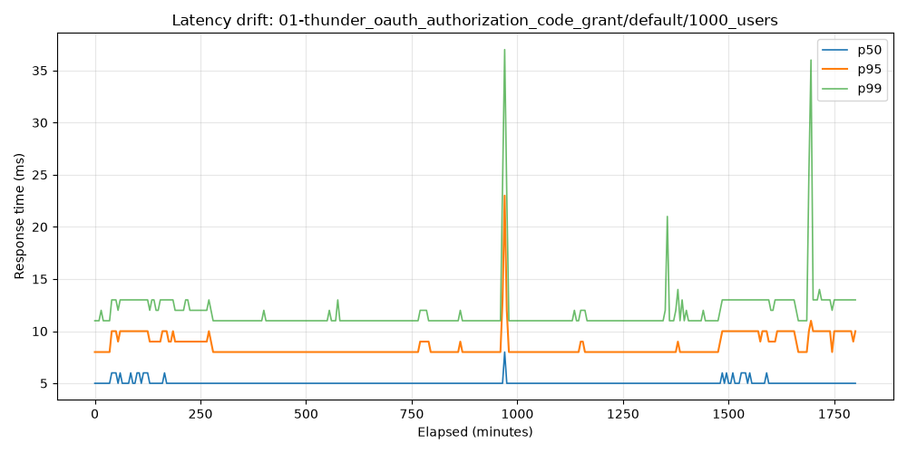
