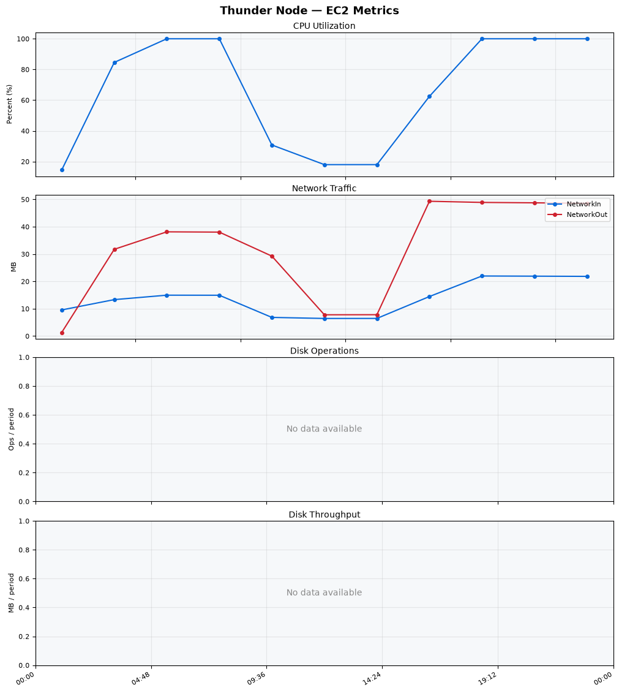
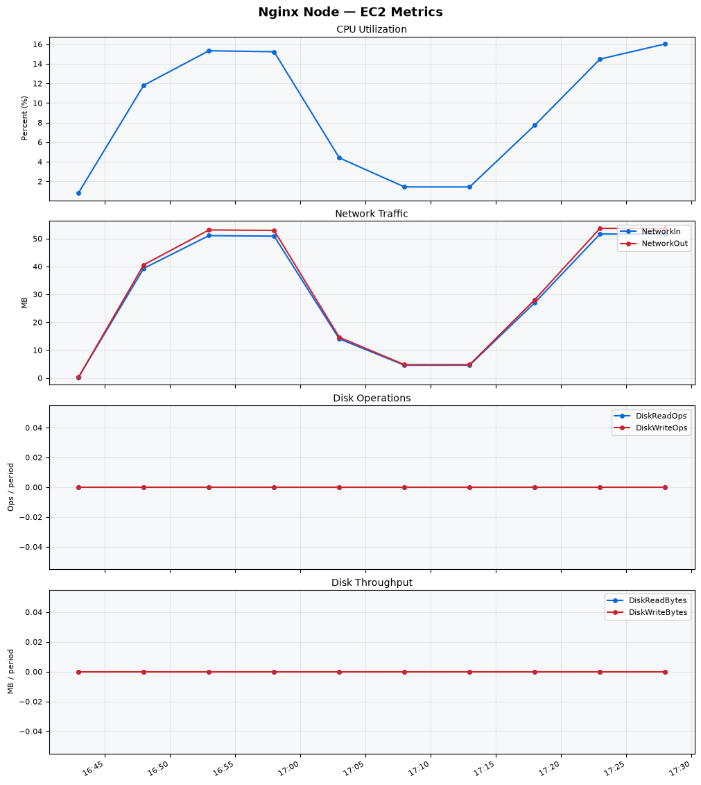
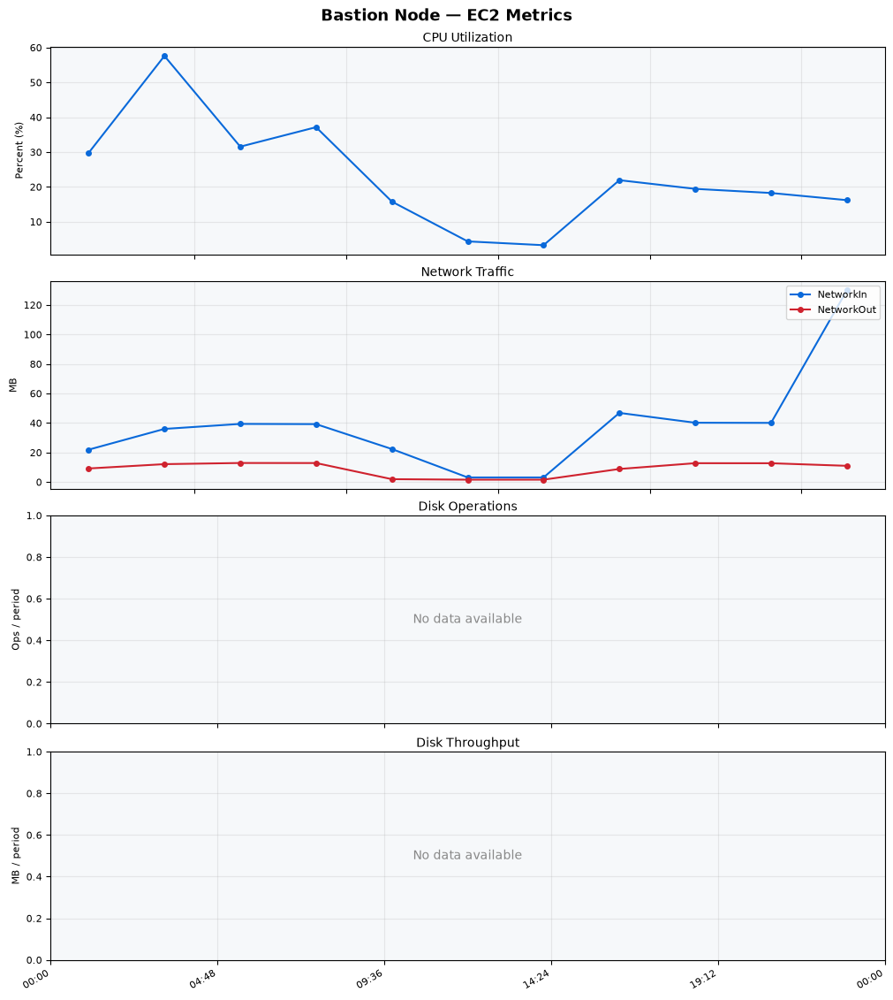
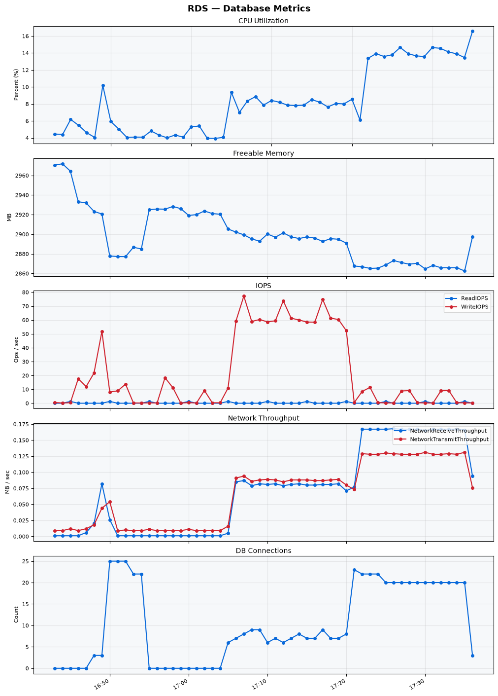

Build Number: 319

Build Date and Time: 2026-07-09--17-43-52

Thunder Pack URL: https://github.com/thunder-id/thunderid/releases/download/v0.47.0/thunderid-0.47.0-linux-x64.zip

Deployment Pattern: single-node

Thunder Instance Type: t2.nano

Nginx Instance Type: t2.nano

Bastion Instance Type: t3a.large

Database Instance Type: db.t3.medium

Database Type: postgres

Concurrency: 50

Thunder Instance ID: i-02a00f06ad472f605

Nginx Instance ID: i-0e2422562b5ac5c05

Bastion Instance ID: i-0f3283de42fbfe759

RDS Instance ID: wso2thunderdbinstance6937

Performance Repo: https://github.com/asgardeo/thunder-performance

Pipeline Definition Branch: main

Checkout Ref (code under test): main

## Summary

| Scenario Name | Heap Size | Concurrent Users | Label | # Samples | Error % | Throughput (Requests/sec) | Average Response Time (ms) | 95th Percentile of Response Time (ms) |
| --- | --- | --- | --- | --- | --- | --- | --- | --- |
| Client Credentials Grant Type | N/A | 50 | 1 Get access token | 298024 | 0.00 | 496.39 | 99.35 | 120.00 |
| Authorization Code Grant Type | N/A | 50 | 1 Send request to authorize endpoint | 4980 | 0.00 | 8.31 | 7.67 | 12.00 |
| Authorization Code Grant Type | N/A | 50 | 2 Start Authentication Flow | 4980 | 0.00 | 8.31 | 5.29 | 7.00 |
| Authorization Code Grant Type | N/A | 50 | 3 Perform authentication | 4980 | 0.00 | 8.31 | 11.57 | 15.00 |
| Authorization Code Grant Type | N/A | 50 | 4 Obtain authorization code | 4980 | 0.00 | 8.31 | 6.53 | 9.00 |
| Authorization Code Grant Type | N/A | 50 | 5 Obtain access token | 4980 | 0.00 | 8.31 | 7.97 | 11.00 |
| User Authentication with Credentials | N/A | 50 | 1 Perform user authentication | 285463 | 0.00 | 475.80 | 104.69 | 193.00 |

## CloudWatch Metrics

### Thunder (EC2)

### Nginx (EC2)

### Bastion (EC2)

### RDS

