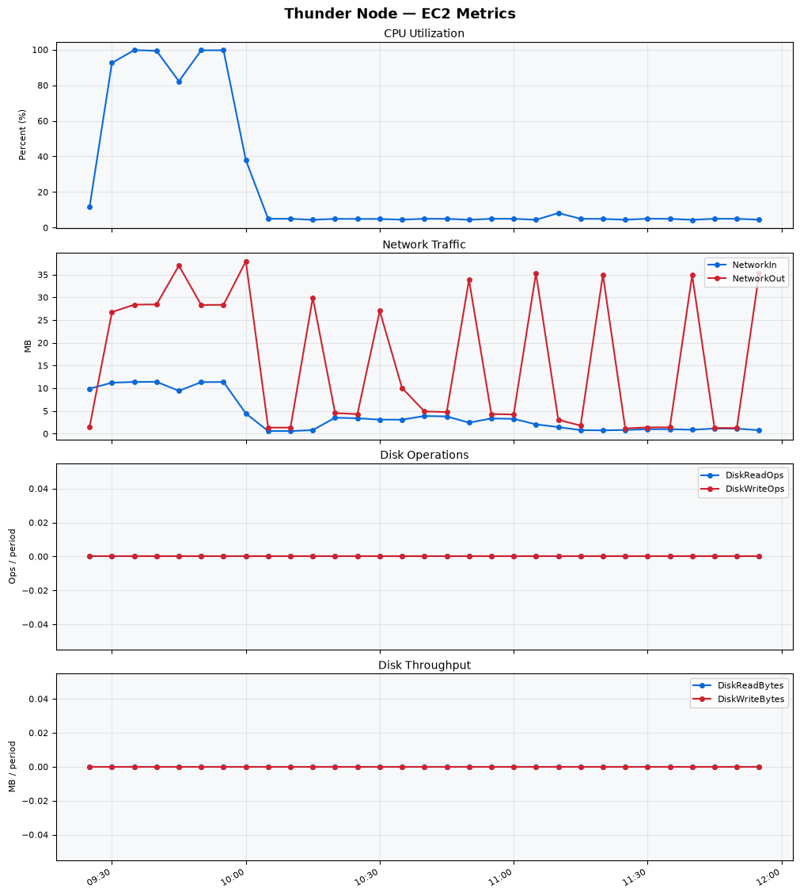
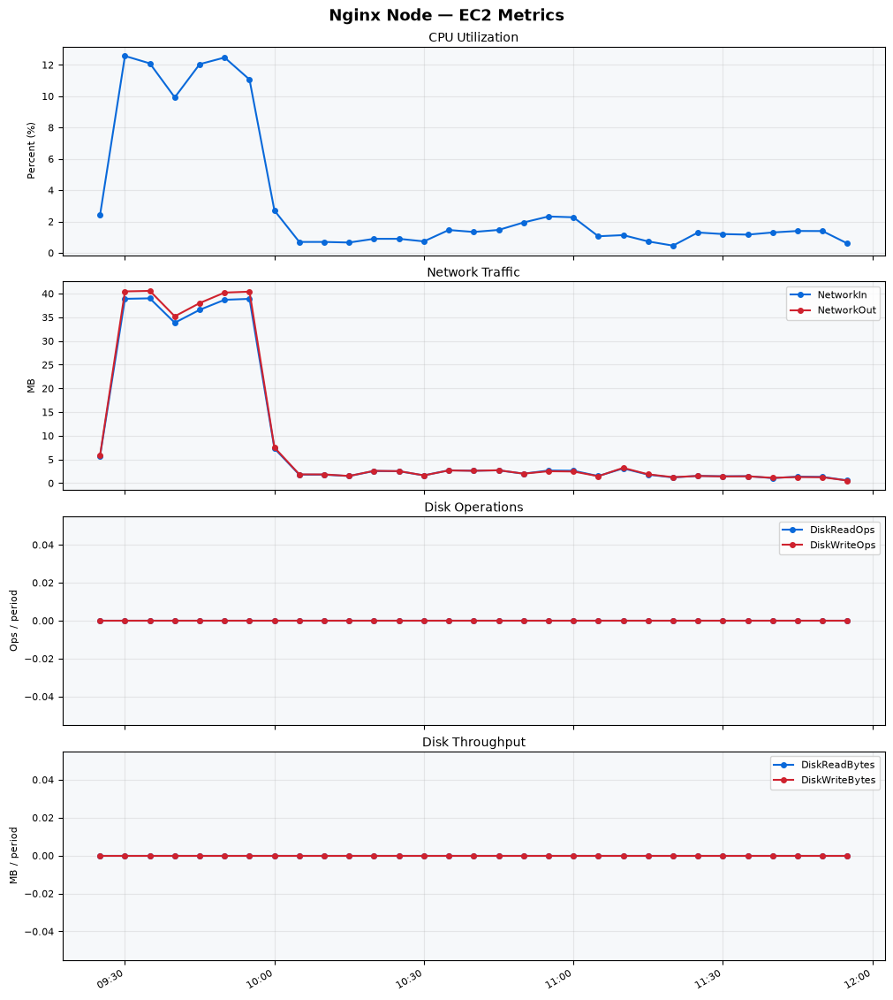
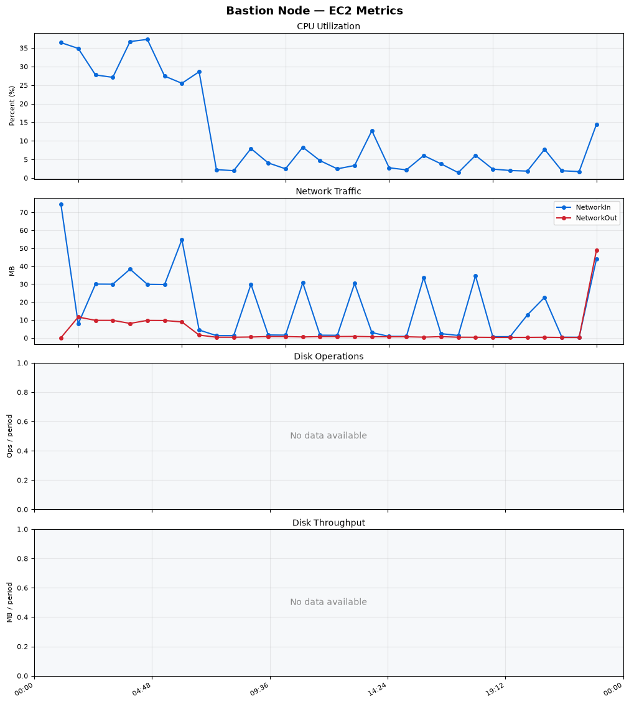
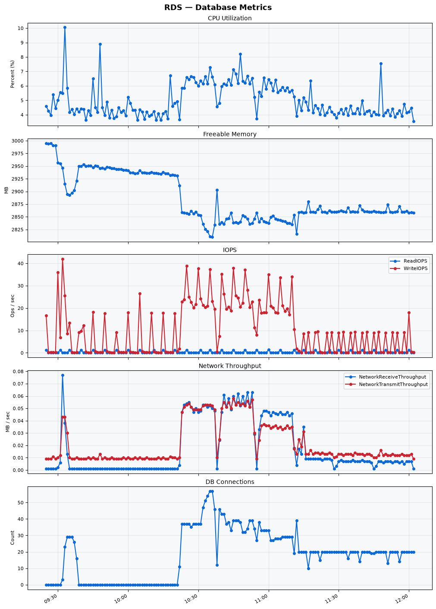

Build Number: 320

Build Date and Time: 2026-07-10--12-10-49

Thunder Pack URL: https://github.com/thunder-id/thunderid/releases/download/v0.47.0/thunderid-0.47.0-linux-x64.zip

Deployment Pattern: single-node

Thunder Instance Type: t2.nano

Nginx Instance Type: t2.nano

Bastion Instance Type: t3a.large

Database Instance Type: db.t3.medium

Database Type: postgres

Concurrency: 50,200,500

Thunder Instance ID: i-076ae44ac45fa1b22

Nginx Instance ID: i-0bb1fb5e11da7b24a

Bastion Instance ID: i-0bba3acab15479324

RDS Instance ID: wso2thunderdbinstance19050

Performance Repo: https://github.com/asgardeo/thunder-performance

Pipeline Definition Branch: main

Checkout Ref (code under test): main

## Summary

| Scenario Name | Heap Size | Concurrent Users | Label | # Samples | Error % | Throughput (Requests/sec) | Average Response Time (ms) | 95th Percentile of Response Time (ms) |
| --- | --- | --- | --- | --- | --- | --- | --- | --- |
| Client Credentials Grant Type | N/A | 50 | 1 Get access token | 227481 | 0.00 | 378.85 | 130.84 | 154.00 |
| Client Credentials Grant Type | N/A | 200 | 1 Get access token | 226946 | 0.00 | 376.89 | 528.90 | 567.00 |
| Client Credentials Grant Type | N/A | 500 | 1 Get access token | 10581 | 1.96 | 16.39 | 28543.69 | 30719.00 |
| Authorization Code Grant Type | N/A | 50 | 1 Send request to authorize endpoint | 2439 | 0.00 | 4.06 | 1447.07 | 3119.00 |
| Authorization Code Grant Type | N/A | 50 | 2 Start Authentication Flow | 2436 | 0.00 | 4.06 | 814.52 | 1815.00 |
| Authorization Code Grant Type | N/A | 50 | 3 Perform authentication | 2424 | 0.00 | 4.04 | 1737.78 | 3535.00 |
| Authorization Code Grant Type | N/A | 50 | 4 Obtain authorization code | 2434 | 0.00 | 4.06 | 1141.29 | 2399.00 |
| Authorization Code Grant Type | N/A | 50 | 5 Obtain access token | 2440 | 0.00 | 4.06 | 1178.33 | 2239.00 |
| Authorization Code Grant Type | N/A | 200 | 1 Send request to authorize endpoint | 2922 | 1.98 | 4.85 | 7321.37 | 22399.00 |
| Authorization Code Grant Type | N/A | 200 | 2 Start Authentication Flow | 2888 | 15.51 | 4.80 | 5915.25 | 15039.00 |
| Authorization Code Grant Type | N/A | 200 | 3 Perform authentication | 2616 | 37.42 | 4.34 | 9200.54 | 20095.00 |
| Authorization Code Grant Type | N/A | 200 | 4 Obtain authorization code | 2945 | 34.80 | 4.89 | 8967.28 | 19839.00 |
| Authorization Code Grant Type | N/A | 200 | 5 Obtain access token | 2927 | 74.27 | 4.86 | 3848.96 | 9919.00 |
| Authorization Code Grant Type | N/A | 500 | 1 Send request to authorize endpoint | 3153 | 60.86 | 5.20 | 31958.82 | 82943.00 |
| Authorization Code Grant Type | N/A | 500 | 2 Start Authentication Flow | 3183 | 91.05 | 5.25 | 14242.75 | 39167.00 |
| Authorization Code Grant Type | N/A | 500 | 3 Perform authentication | 2998 | 97.90 | 4.95 | 15101.78 | 39167.00 |
| Authorization Code Grant Type | N/A | 500 | 4 Obtain authorization code | 3186 | 51.79 | 5.26 | 14371.20 | 40447.00 |
| Authorization Code Grant Type | N/A | 500 | 5 Obtain access token | 3159 | 99.94 | 5.22 | 10994.22 | 30463.00 |
| User Authentication with Credentials | N/A | 50 | 1 Perform user authentication | 10056 | 0.13 | 16.69 | 2978.85 | 5663.00 |
| User Authentication with Credentials | N/A | 200 | 1 Perform user authentication | 7956 | 49.74 | 13.01 | 14874.53 | 40447.00 |
| User Authentication with Credentials | N/A | 500 | 1 Perform user authentication | 6920 | 81.23 | 11.00 | 41452.42 | 115199.00 |

## CloudWatch Metrics

### Thunder (EC2)

### Nginx (EC2)

### Bastion (EC2)

### RDS

