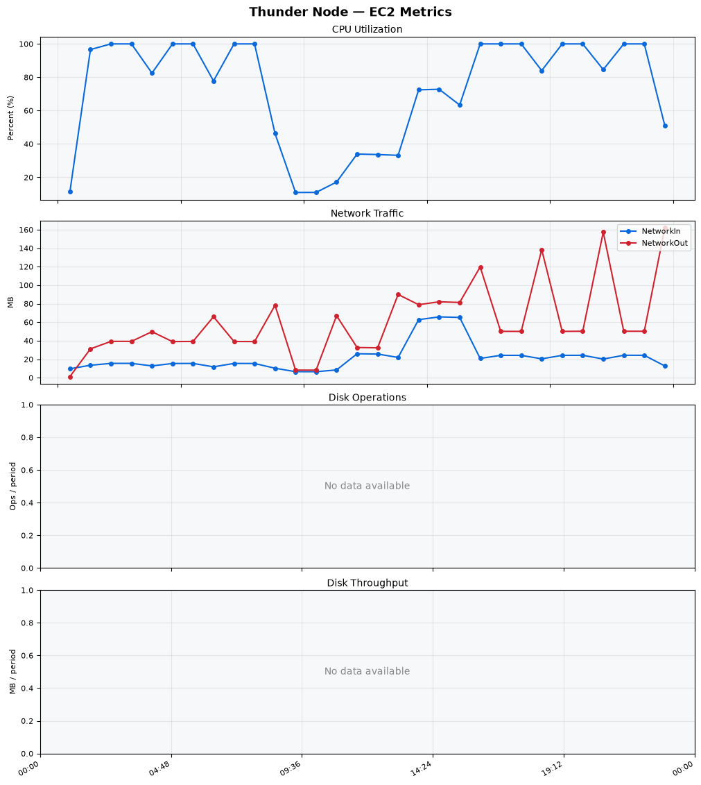
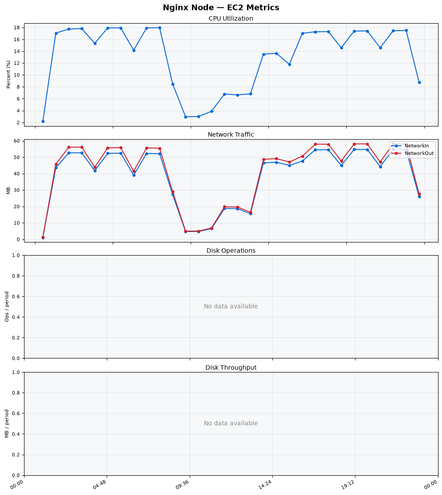
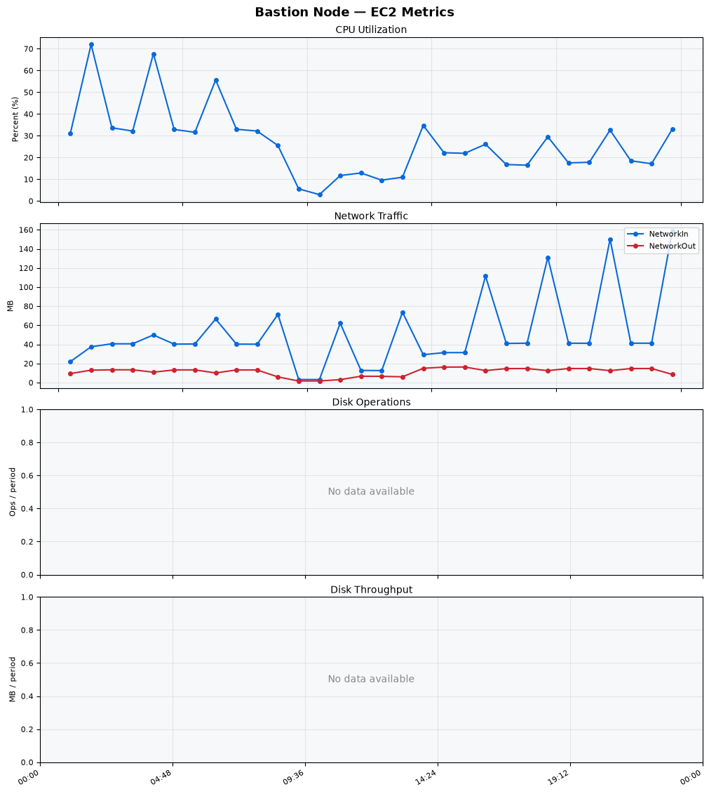
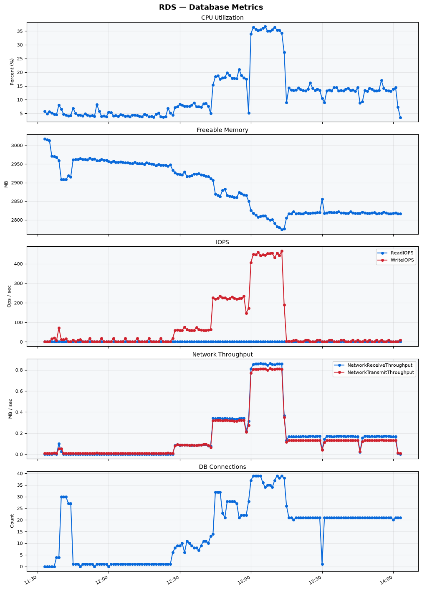

Build Number: 327

Build Date and Time: 2026-07-17--14-11-57

Thunder Pack URL: https://github.com/thunder-id/thunderid/releases/download/v0.48.0/thunderid-0.48.0-linux-x64.zip

Deployment Pattern: single-node

Thunder Instance Type: t2.nano

Nginx Instance Type: t2.nano

Bastion Instance Type: t3a.large

Database Instance Type: db.t3.medium

Database Type: postgres

Concurrency: 50,200,500

Thunder Instance ID: i-0c4f1fcb6f177fec2

Nginx Instance ID: i-00669a8fa839e63f7

Bastion Instance ID: i-0ceb36a0ba563f93f

RDS Instance ID: wso2thunderdbinstance2736

Performance Repo: https://github.com/asgardeo/thunder-performance

Pipeline Definition Branch: main

Checkout Ref (code under test): main

## Summary

| Scenario Name | Heap Size | Concurrent Users | Label | # Samples | Error % | Throughput (Requests/sec) | Average Response Time (ms) | 95th Percentile of Response Time (ms) |
| --- | --- | --- | --- | --- | --- | --- | --- | --- |
| Client Credentials Grant Type | N/A | 50 | 1 Get access token | 307685 | 0.00 | 512.44 | 96.30 | 117.00 |
| Client Credentials Grant Type | N/A | 200 | 1 Get access token | 306389 | 0.00 | 508.87 | 391.80 | 421.00 |
| Client Credentials Grant Type | N/A | 500 | 1 Get access token | 306514 | 0.00 | 506.68 | 981.22 | 1031.00 |
| Authorization Code Grant Type | N/A | 50 | 1 Send request to authorize endpoint | 4973 | 0.00 | 8.29 | 6.77 | 12.00 |
| Authorization Code Grant Type | N/A | 50 | 2 Start Authentication Flow | 4973 | 0.00 | 8.29 | 4.46 | 7.00 |
| Authorization Code Grant Type | N/A | 50 | 3 Perform authentication | 4972 | 0.00 | 8.29 | 10.11 | 15.00 |
| Authorization Code Grant Type | N/A | 50 | 4 Obtain authorization code | 4972 | 0.00 | 8.29 | 5.41 | 8.00 |
| Authorization Code Grant Type | N/A | 50 | 5 Obtain access token | 4973 | 0.00 | 8.29 | 6.83 | 10.00 |
| Authorization Code Grant Type | N/A | 200 | 1 Send request to authorize endpoint | 19828 | 0.00 | 33.06 | 7.77 | 14.00 |
| Authorization Code Grant Type | N/A | 200 | 2 Start Authentication Flow | 19828 | 0.00 | 33.06 | 5.49 | 10.00 |
| Authorization Code Grant Type | N/A | 200 | 3 Perform authentication | 19828 | 0.00 | 33.06 | 11.56 | 19.00 |
| Authorization Code Grant Type | N/A | 200 | 4 Obtain authorization code | 19828 | 0.00 | 33.06 | 6.66 | 12.00 |
| Authorization Code Grant Type | N/A | 200 | 5 Obtain access token | 19828 | 0.00 | 33.06 | 8.05 | 13.00 |
| Authorization Code Grant Type | N/A | 500 | 1 Send request to authorize endpoint | 49339 | 0.00 | 82.27 | 14.41 | 34.00 |
| Authorization Code Grant Type | N/A | 500 | 2 Start Authentication Flow | 49338 | 0.00 | 82.27 | 11.01 | 26.00 |
| Authorization Code Grant Type | N/A | 500 | 3 Perform authentication | 49338 | 0.00 | 82.27 | 22.53 | 55.00 |
| Authorization Code Grant Type | N/A | 500 | 4 Obtain authorization code | 49338 | 0.00 | 82.27 | 13.49 | 30.00 |
| Authorization Code Grant Type | N/A | 500 | 5 Obtain access token | 49338 | 0.00 | 82.27 | 13.92 | 32.00 |
| User Authentication with Credentials | N/A | 50 | 1 Perform user authentication | 293075 | 0.00 | 488.49 | 102.02 | 188.00 |
| User Authentication with Credentials | N/A | 200 | 1 Perform user authentication | 293245 | 0.00 | 488.56 | 408.93 | 1111.00 |
| User Authentication with Credentials | N/A | 500 | 1 Perform user authentication | 292952 | 0.00 | 487.59 | 1022.95 | 2959.00 |

## CloudWatch Metrics

### Thunder (EC2)

### Nginx (EC2)

### Bastion (EC2)

### RDS

