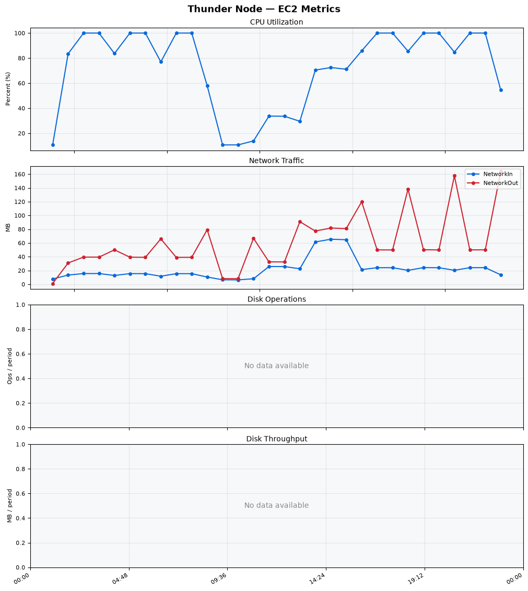
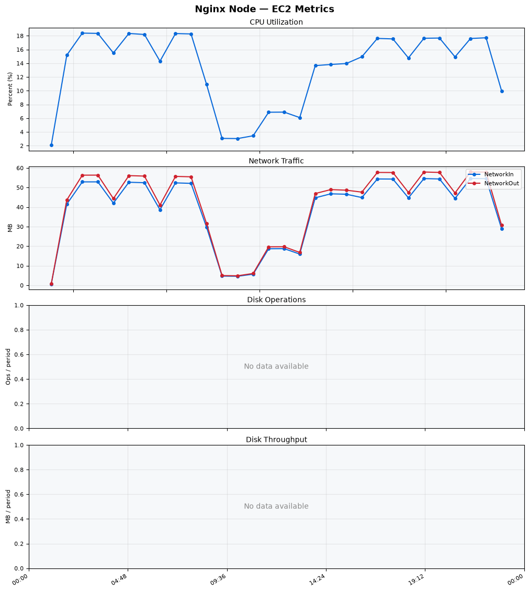
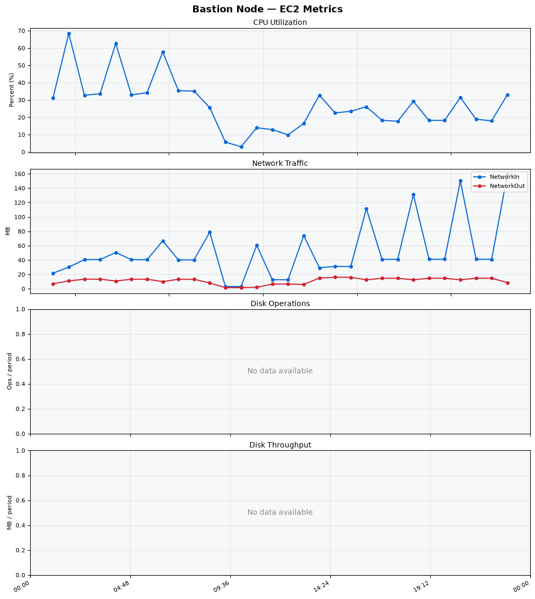
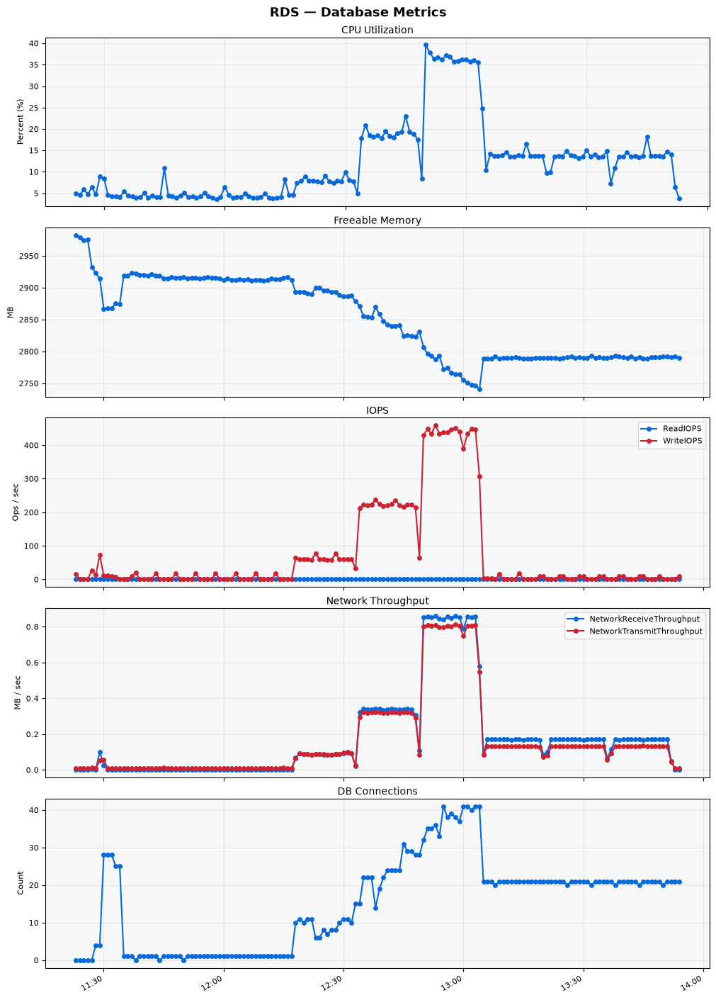

Build Number: 336

Build Date and Time: 2026-07-22--14-02-27

Thunder Pack URL: https://github.com/thunder-id/thunderid/releases/download/v1.0.0-alpha/thunderid-1.0.0-alpha-linux-x64.zip

Deployment Pattern: single-node

Thunder Instance Type: t2.nano

Nginx Instance Type: t2.nano

Bastion Instance Type: t3a.large

Database Instance Type: db.t3.medium

Database Type: postgres

Concurrency: 50,200,500

Thunder Instance ID: i-003876d1baacb5ddd

Nginx Instance ID: i-08915c2d1c76b5d52

Bastion Instance ID: i-013f30694d8ca533d

RDS Instance ID: wso2thunderdbinstance30939

Performance Repo: https://github.com/asgardeo/thunder-performance

Pipeline Definition Branch: main

Checkout Ref (code under test): main

## Summary

| Scenario Name | Heap Size | Concurrent Users | Label | # Samples | Error % | Throughput (Requests/sec) | Average Response Time (ms) | 95th Percentile of Response Time (ms) |
| --- | --- | --- | --- | --- | --- | --- | --- | --- |
| Client Credentials Grant Type | N/A | 50 | 1 Get access token | 308915 | 0.00 | 514.46 | 95.57 | 117.00 |
| Client Credentials Grant Type | N/A | 200 | 1 Get access token | 307395 | 0.00 | 510.60 | 390.49 | 421.00 |
| Client Credentials Grant Type | N/A | 500 | 1 Get access token | 307141 | 0.00 | 507.24 | 979.33 | 1031.00 |
| Authorization Code Grant Type | N/A | 50 | 1 Send request to authorize endpoint | 4989 | 0.00 | 8.32 | 6.65 | 11.00 |
| Authorization Code Grant Type | N/A | 50 | 2 Start Authentication Flow | 4989 | 0.00 | 8.32 | 4.37 | 7.00 |
| Authorization Code Grant Type | N/A | 50 | 3 Perform authentication | 4990 | 0.00 | 8.32 | 9.96 | 14.00 |
| Authorization Code Grant Type | N/A | 50 | 4 Obtain authorization code | 4990 | 0.00 | 8.32 | 5.33 | 8.00 |
| Authorization Code Grant Type | N/A | 50 | 5 Obtain access token | 4989 | 0.00 | 8.32 | 6.73 | 9.00 |
| Authorization Code Grant Type | N/A | 200 | 1 Send request to authorize endpoint | 19876 | 0.00 | 33.15 | 8.02 | 15.00 |
| Authorization Code Grant Type | N/A | 200 | 2 Start Authentication Flow | 19877 | 0.00 | 33.14 | 5.75 | 11.00 |
| Authorization Code Grant Type | N/A | 200 | 3 Perform authentication | 19876 | 0.00 | 33.14 | 12.08 | 20.00 |
| Authorization Code Grant Type | N/A | 200 | 4 Obtain authorization code | 19876 | 0.00 | 33.15 | 7.17 | 12.00 |
| Authorization Code Grant Type | N/A | 200 | 5 Obtain access token | 19876 | 0.00 | 33.15 | 8.24 | 14.00 |
| Authorization Code Grant Type | N/A | 500 | 1 Send request to authorize endpoint | 48816 | 0.00 | 81.41 | 25.72 | 48.00 |
| Authorization Code Grant Type | N/A | 500 | 2 Start Authentication Flow | 48816 | 0.00 | 81.41 | 20.80 | 38.00 |
| Authorization Code Grant Type | N/A | 500 | 3 Perform authentication | 48816 | 0.00 | 81.40 | 38.26 | 79.00 |
| Authorization Code Grant Type | N/A | 500 | 4 Obtain authorization code | 48817 | 0.00 | 81.40 | 31.41 | 47.00 |
| Authorization Code Grant Type | N/A | 500 | 5 Obtain access token | 48815 | 0.00 | 81.41 | 20.45 | 44.00 |
| User Authentication with Credentials | N/A | 50 | 1 Perform user authentication | 291905 | 0.00 | 486.56 | 102.39 | 189.00 |
| User Authentication with Credentials | N/A | 200 | 1 Perform user authentication | 292790 | 0.00 | 487.82 | 409.54 | 1111.00 |
| User Authentication with Credentials | N/A | 500 | 1 Perform user authentication | 293060 | 0.00 | 487.79 | 1022.60 | 2943.00 |

## CloudWatch Metrics

### Thunder (EC2)

### Nginx (EC2)

### Bastion (EC2)

### RDS

